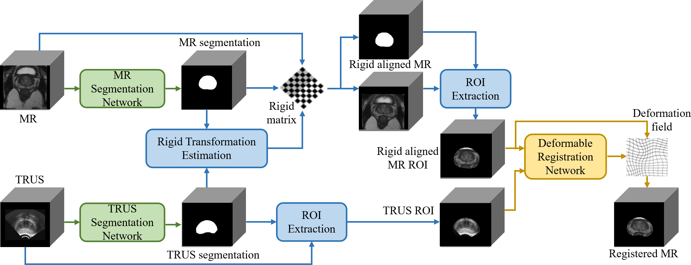

# Salient Region Marching for Fully Automated MR-TRUS Registration

## The schematic view of the proposed MR-TRUS registration framework

## Installation
The code is tested with PyTorch 2.0.1 and CUDA 11.8.

